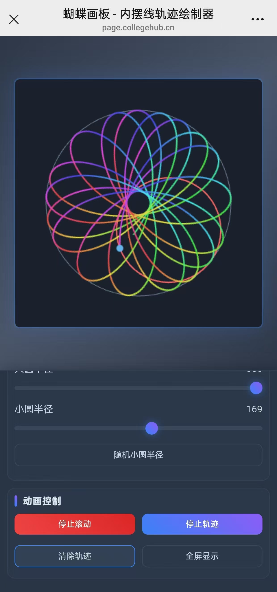

# 蝴蝶画板 - 内摆线轨迹绘制器

## 项目徽章

| 类别 | 徽章 | 描述 |
|------|------|------|
| GitHub |  | 项目 Star 数 |
|  |  | 项目 Fork 数 |
|  |  | 待解决问题 |
|  |  | 最新版本 |
| 构建 |  | 构建状态 |
| 代码质量 |  | 代码覆盖率 |
| 依赖 |  | 依赖状态 |
| 社区 |  | 贡献者数 |
| 活跃度 |  | 最后提交 |
|  |  | 每月提交 |
| 许可证 |  | 开源协议 |

## 项目简介
这是一个基于 HTML5 Canvas 的动态内摆线轨迹绘制工具，支持实时调整参数和颜色设置，生成美丽的蝴蝶状轨迹。

### 预览效果
- **电脑/平板横屏版**：
  
- **手机竖屏版**：
  

## 功能特性
- **动态轨迹绘制**：通过调整大圆和小圆的半径，生成不同的内摆线轨迹。
- **动画控制**：支持开始/停止动画、清除轨迹和全屏显示。
- **颜色设置**：通过 RGB 滑块调整轨迹颜色，支持随机颜色和渐变模式。
- **响应式设计**：适配桌面、平板和手机等多种设备。

## 使用方法
1. **启动项目**：直接打开 `responsive-butterfly-v3.html` 文件即可运行。
2. **操作界面**：
   - **控制面板**：调整半径、启停动画、清除轨迹。
   - **颜色面板**：设置轨迹颜色和渐变模式。
   - **设置面板**：导出图片和查看状态信息。
3. **功能按钮**：
   - **开始滚动**：启动动画。
   - **停止轨迹**：暂停轨迹记录。
   - **清除轨迹**：重置画布。
   - **随机颜色**：生成随机轨迹颜色。

## 技术栈
- **前端**：HTML5, CSS3, JavaScript (原生 Canvas API)
- **兼容性**：支持现代浏览器（Chrome, Firefox, Edge 等）

## 响应式设计
本项目通过动态布局和交互优化，完美适配不同设备和屏幕尺寸：
- **桌面**：左侧控制面板，右侧画布区域，充分利用大屏幕空间。
- **平板/手机**：控制面板折叠为选项卡形式，画布自动适配屏幕尺寸，确保操作便捷性和显示完整性。
- **自适应核心**：实时检测屏幕尺寸变化，动态调整画布和控制面板布局，提供一致的交互体验。

## 后续扩展
- 支持更多轨迹样式（如玫瑰线、心形线）。
- 添加轨迹宽度和透明度调整功能。

## 在线预览

## 许可证 (License)

### 中文
MIT 许可证

版权所有 (c) 2025 AdamShuo

特此免费授予任何获得本软件及相关文档文件（以下简称“软件”）副本的人无限制使用软件的权利，包括但不限于使用、复制、修改、合并、发布、分发、再许可和/或出售软件副本的权利，以及允许软件接收者这样做的权利，但须符合以下条件：

上述版权声明和本许可声明应包含在软件的所有副本或主要部分中。

本软件按“原样”提供，不提供任何形式的明示或暗示保证，包括但不限于适销性、特定用途适用性和非侵权性。在任何情况下，作者或版权持有人均不对任何索赔、损害或其他责任负责，无论是合同、侵权还是其他行为引起的，与软件或软件的使用或其他交易有关。

### English
MIT License

Copyright (c) 2025 AdamShuo

Permission is hereby granted, free of charge, to any person obtaining a copy of this software and associated documentation files (the "Software"), to deal in the Software without restriction, including without limitation the rights to use, copy, modify, merge, publish, distribute, sublicense, and/or sell copies of the Software, and to permit persons to whom the Software is furnished to do so, subject to the following conditions:

The above copyright notice and this permission notice shall be included in all copies or substantial portions of the Software.

THE SOFTWARE IS PROVIDED "AS IS", WITHOUT WARRANTY OF ANY KIND, EXPRESS OR IMPLIED, INCLUDING BUT NOT LIMITED TO THE WARRANTIES OF MERCHANTABILITY, FITNESS FOR A PARTICULAR PURPOSE AND NONINFRINGEMENT. IN NO EVENT SHALL THE AUTHORS OR COPYRIGHT HOLDERS BE LIABLE FOR ANY CLAIM, DAMAGES OR OTHER LIABILITY, WHETHER IN AN ACTION OF CONTRACT, TORT OR OTHERWISE, ARISING FROM, OUT OF OR IN CONNECTION WITH THE SOFTWARE OR THE USE OR OTHER DEALINGS IN THE SOFTWARE.